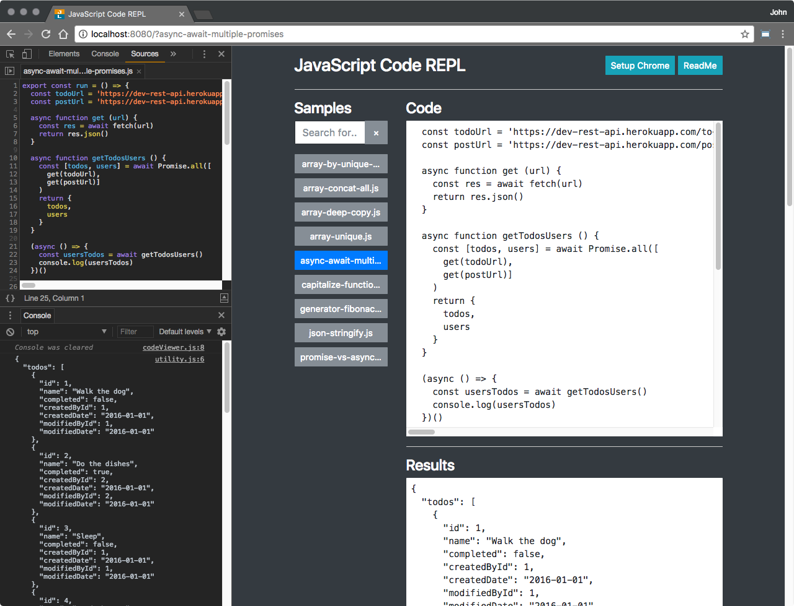

# JavaScript Code REPL

A minimalist Webpack 3.x and Babel 6.x project for playing around with JavaScript features. The only other libraries are Bootstrap for styling and <a target="_blank" title="standard" href="https://github.com/standard/standard">standard</a> for linting. Both can be easily removed.

---

## Install Dependencies

```javascript
npm install
```

## Run

```javascript
npm start
```

Open http://localhost:8080

This does two things:

1 Builds a simple array saved in **codeFiles.js** based on the samples directory. This is consumed by **codeViewer.js** to build a simple UI.
2 Runs webpack-dev-server with **live-reloading** enabled.

> Note: If you don't want the UI, simply comment out or remove the import of **codeViewer.js**

---

## Tweaking the Code

There are two primary options:

1 Use the index.js file and optionally comment out the import.
2 Add or change any file in the samples folder. If adding, be sure to wrap it with the following:

```javascript
export const run = () => {
  /*your code here*/
}
```

> **Important**: This is used to dynamically run the code when loaded. If adding a new file to **samples**, be sure to run ```npm start``` to rebuild the data and UI.

---

## Chrome Debugging

Check out my blog post for some tips on debugging in Chrome:

<a target="_blank" title="" href="https://www.johnlivingston.io/blog/chrome-save-repl">
Chrome Developer Tools - Save Files Locally and Building a REPL
</a>

---

## Tweaking Babel Transpilation

The **.babelrc** uses a barebones babel-preset-env config, which targets the absolute bleeding edge JavaScript features. You can scale this down by tweaking the **.babelrc** file. See <a target="_blank" title="babel-preset-env" href="https://github.com/babel/babel-preset-env">
babel-preset-env
</a>.

---

## Miscellaneous

- **Removing Bootstrap and standard** - For Bootstrap, simply remove the CDN reference in **public/index.html**. For standard, run ```npm uninstall standard --save-dev```, then remove the **standard** references in package.json.
- **Browser Compatibility** - Minimally tested in Chrome 60, Safari 10, and Opera 46
- **Webpack Bug** - has a redundant compilation issue you may see sporadically when you running ```npm start``` to launch the **webpack-dev-server**. This does no harm, but may be confusing if you see it. See <a target="_blank" title="Hot reload triggered multiple times in a row when launching dev server" href="https://github.com/webpack/webpack/issues/2983">Hot reload triggered multiple times in a row when launching dev server</a>
- **Console Hack** - There is one small hack in **utility.js** where I bind to console.log. This allows me to intercept console.log calls made in the samples folders so I can output to the results field without expecting additional references in those files. **WARNING:** This is a fun pattern, but it should never be used in a real application.

---

## Screenshot



---

## Author

<a target="_blank" title="johnlivingston.io" href="https://www.johnlivingston.io/">John Livingston - johnlivingston.io</a>
